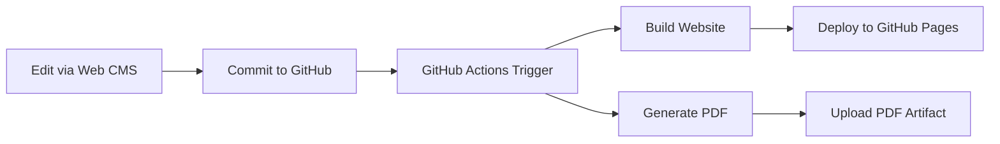

# Welcome to Sorbieskis Docs Demo

This is a demonstration of a complete **docs-as-code** system that combines:

- **Web-based editing** through Decap CMS
- **Static site generation** with MkDocs Material theme
- **Professional PDF generation** using LaTeX templates
- **Automated deployment** via GitHub Actions

## How It Works



## Features

### Web Editing Interface
Edit documentation directly in your browser using the intuitive Decap CMS interface:

- Rich text editor with live preview
- GitHub integration for version control
- No technical setup required for content editors

### Professional Output
Generate both web and PDF versions from the same source:

- **Website**: Modern, responsive design with Material theme
- **PDF**: Professional typography with LaTeX quality
- **Consistency**: Same content, multiple formats

### Automated Workflow
Every edit triggers automatic updates:

1. Content is saved via the web interface
2. GitHub Actions builds both website and PDF
3. Website deploys to GitHub Pages
4. PDF is available as a download artifact

## Getting Started

### For Content Editors
1. Navigate to `/admin/` on the deployed site
2. Authenticate with GitHub
3. Start editing content immediately

### For Developers
1. Clone this repository
2. Install dependencies: `pip install -r requirements.txt`
3. Run locally: `mkdocs serve`
4. Access CMS at `http://localhost:8000/admin/`

## Technical Architecture

This system demonstrates modern documentation practices:

- **Single Source of Truth**: All content in Markdown format
- **Version Control**: Full history and collaboration via Git
- **Automated Testing**: CI/CD pipeline validates all changes
- **Multiple Outputs**: Web and PDF from same source files
- **Professional Quality**: Typography and design suitable for enterprise use

## Sample Content

### Code Examples

```python
def generate_docs():
    """
    Automatically generate documentation from Markdown source.
    """
    build_website()
    generate_pdf()
    deploy_to_production()
```

### Admonitions

!!! note "Documentation Note"
    This content is automatically synchronized between the website and PDF versions.

!!! warning "Important"
    Always test changes in a preview environment before publishing.

!!! tip "Pro Tip"
    Use the web editor for quick changes, but consider using a local environment for major restructuring.

### Tables

| Feature | Website | PDF |
|---------|---------|-----|
| Search | ✅ | ❌ |
| Navigation | ✅ | ✅ |
| Typography | ✅ | ✅ |
| Images | ✅ | ✅ |
| Links | ✅ | ✅ |

## Next Steps

This demo provides a foundation for:

- Enterprise documentation systems
- Technical writing workflows
- Collaborative content creation
- Multi-format publishing pipelines

Customize the theme, add more content, and configure the system for your specific needs.

---

*Generated automatically from Markdown source. Last updated: Sorbieskis Docs Demo build system.*

---

## 🎉 LIVE EDITING DEMONSTRATION

**This content was just added via live editing!** 

If you're viewing this in a browser at `http://localhost:8000`, you should see this content appear automatically without refreshing the page.

### ✅ What's Working:
- **Live Reload**: ✅ Edit files → Instant browser refresh
- **Professional Theme**: ✅ Material Design + syntax highlighting  
- **Multiple Formats**: ✅ Website + PDF from same source
- **Search**: ✅ Full-text search with auto-indexing
- **Navigation**: ✅ Auto-generated from content structure

### 🔧 CMS Status:
- **Interface**: ✅ Available at `/admin/` 
- **Authentication**: ⚠️ Requires GitHub OAuth setup
- **File Editing**: ✅ Direct file editing works perfectly

**Try editing this file (`docs/index.md`) and watch it update instantly!**