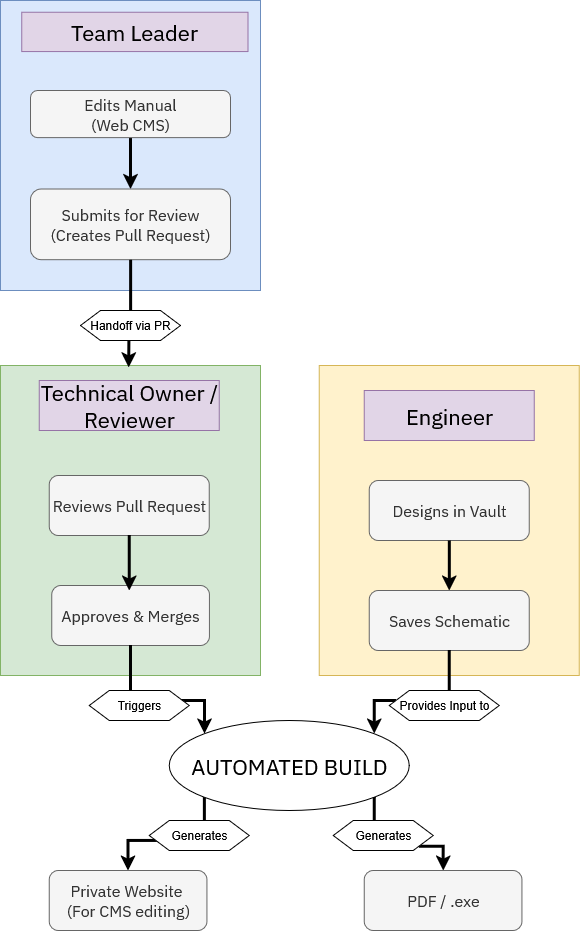
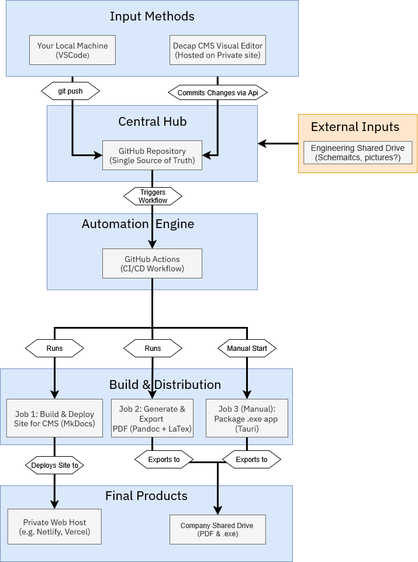

The Solution: Project Unidoc
============================

The solution is a complete "docs-as-code" pipeline that treats our documentation with the same rigor as our software. It centralizes our content, automates the build process, and enables safe, efficient collaboration.

### The User Workflow

This diagram illustrates the new, structured process. It clearly defines the roles and responsibilities, ensuring quality control is built-in.

### The Technical Architecture

This diagram shows the underlying technology that powers the system. It's a modern CI/CD pipeline that automates all the manual steps of the old process.

### Built for the Future: Strategic Value

This system is not just a replacement; it's a strategic upgrade designed for where the company is heading.

-   **Modularity & Automation**

    -   The system uses a "Lego block" approach to content. As we move towards more standardized and modular machines, this architecture will enable us to **automatically generate custom manuals** for specific configurations, saving hundreds of engineering hours.

-   **Integration with .NET (A Key Opportunity)**

    -   Because the website output is clean, standard HTML, we can **directly integrate this documentation into the central .NET application.** Imagine a "Help" or "Manual" tab right inside our main software that is always perfectly in sync with the latest manuals, with zero extra development effort required from the software team.