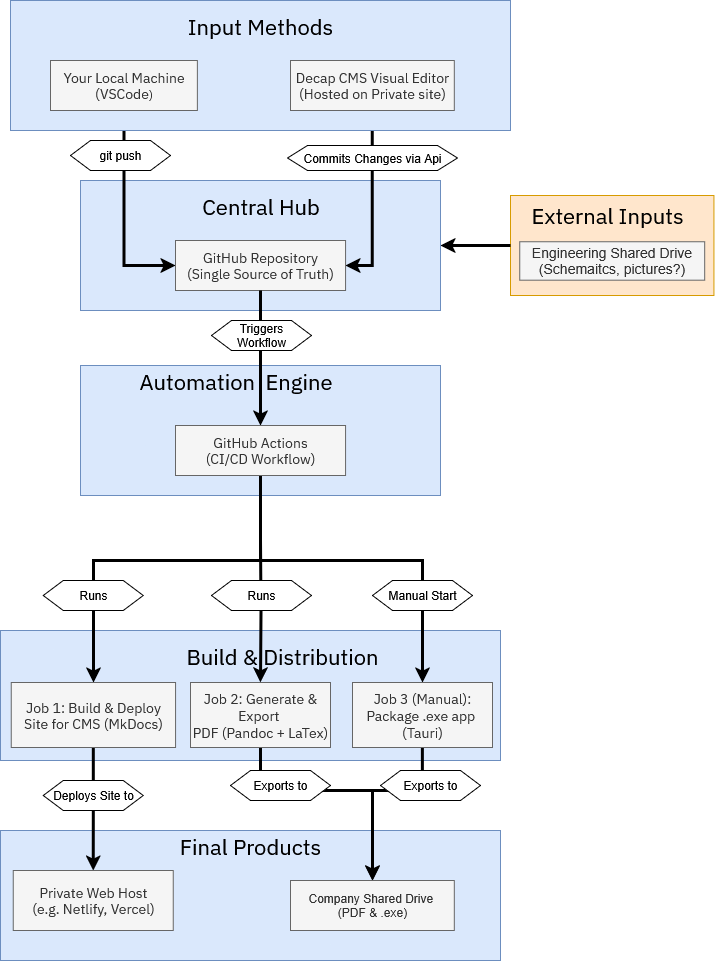

---
title: "Company Header"
component_type: "reusable"
---

# Project Unidoc

*Enterprise Documentation Management System*

---

---
title: "Home Introduction"
component_type: "unique"
---

This presentation demonstrates the high-quality, professional standard now achievable for all company technical manuals through **Project Unidoc**.

The core of this new standard is delivering documentation that is not only accurate and easy to maintain, but also highly accessible and user-friendly.

## Live Demonstration: The Modern Web-Based Manual

As the first step, we'll look at the live, searchable website version of our software manual.

**Key Features to Notice:**

* **Instant Access:** The site is fast, responsive, and works in any modern browser.
* **Powerful Search:** The entire manual is indexed for instant, accurate search results, making it incredibly easy for users to find the information they need.
* **Always Up-to-Date:** Because this site is built automatically from our central source, it is guaranteed to always reflect the latest approved information.
* **Future-Ready:** The same system that builds this website can also package it into a standalone desktop app for offline use by our service engineers in the future.

---

---
title: "Problem Analysis"
component_type: "unique"
---

# Solving Our Core Documentation Challenges

"Project Unidoc" was designed to solve specific, long-standing problems with the previous documentation process. The old workflow, while familiar, created significant inefficiencies and quality control issues.

## Key Problems with the "Old Way"

-   **No Single Source of Truth**

    -   Scattered Word documents and PDFs on a shared drive led to constant version confusion. It was difficult to know which file was the latest, "official" version.

-   **Inefficient & Error-Prone Workflow**

    -   The process relied on manual copy-pasting of content between documents, which was time-consuming and a frequent source of human error.

-   **Lack of Version Control**

    -   There was no reliable way to track changes, review a document's history, or revert to a previous good state if a mistake was made.

-   **Inconsistent Quality & Branding**

    -   Formatting, branding, and style varied significantly between documents, appearing unprofessional to clients and confusing for internal users.

-   **No Safe Contribution Pathway**

    -   The old system provided no safe or structured way for subject matter experts to contribute directly. The new system's review workflow (Pull Requests) acts as a crucial quality gate, enabling anyone---from team leaders to other engineers---to propose changes without risk, eliminating bottlenecks and encouraging collaboration.

---

---
title: "Solution Overview"
component_type: "unique"
---

# The Solution: Project Unidoc

Project Unidoc transforms documentation from a burden into a strategic asset through automated, scalable workflows that eliminate manual processes while ensuring consistency and quality.

## Core Solution Architecture

**The 3-Step Manual Creation Process:**
1. **Write** - Content creators focus purely on writing in Markdown
2. **Review** - Automated pull request workflow ensures quality control  
3. **Publish** - Simultaneous generation of website and print-ready PDF

This streamlined process reduces manual creation time from weeks to hours.

## Technical Infrastructure

The system leverages modern CI/CD principles with Git as the single source of truth, automated builds, and multiple output formats from unified source content.

---

---
title: "Scaling Capabilities"
component_type: "unique"
---

# Scaling the System: Enterprise Capabilities

## Multi-Manual Management at Scale

Project Unidoc is architected to handle enterprise-scale documentation requirements:

- **Centralized Content Repository**: Single Git repository manages unlimited manuals with shared components
- **Template-Driven Architecture**: Consistent styling and structure across all documentation outputs
- **Automated Cross-References**: Dynamic linking between related manuals and sections
- **Version Management**: Git-based versioning ensures historical tracking and rollback capabilities

## Team Collaboration Workflows

**Distributed Authoring Model**:
- Technical teams contribute directly via Git commits
- Subject matter experts use web-based CMS interface
- All changes flow through unified review and approval process
- Conflict resolution built into the workflow

**Quality Assurance Integration**:
- Automated style and consistency checking
- Link validation across all documents
- Spelling and grammar verification
- Technical accuracy reviews through pull request workflow

## Enterprise-Grade Scalability Features

**Content Reuse and Modularity**:
- Shared component library across all manuals
- Dynamic content inclusion and templating
- Automated generation of custom manual variants
- Conditional content based on product configurations

**Multi-Format Publishing Pipeline**:
- Simultaneous generation of web, PDF, and mobile-optimized formats
- Custom branding and styling per manual or product line
- Integration-ready HTML output for embedding in applications
- Print-ready PDF with professional typography and layout

**Operational Excellence**:
- Automated backup and disaster recovery
- Performance monitoring and optimization
- Scalable hosting infrastructure
- Integration with enterprise authentication systems

---

---
title: "Business Value"
component_type: "unique"
---

# Strategic Business Value

## Immediate Impact
- **Zero formatting inconsistencies** across all outputs
- **Elimination of version control errors** through single source of truth

## Long-Term Scalability Benefits
- **Infinite manual capacity** without proportional resource increases
- **Automated custom manual generation** for specific product configurations
- **Enterprise application integration** capabilities for embedded documentation

This solution transforms documentation from a cost center into a competitive advantage through systematic automation and scalable architecture.

---

